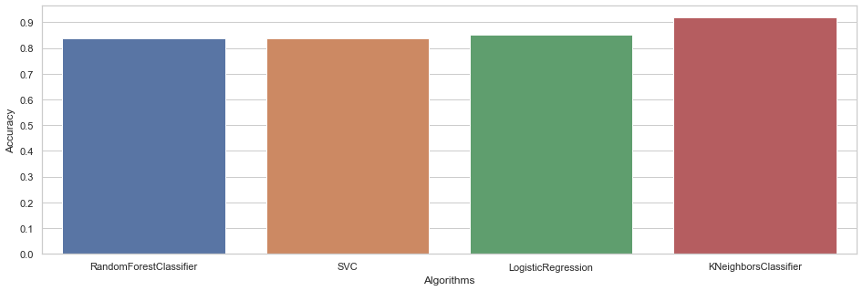

# Heart Disease - Classifications

This repository involves exploratory data analysis (EDA), visualizations, and the prediction of the presence of heart disease in patients using several machine learning algorithms.

## Table of Contents
- [Introduction](#introduction)
- [Data Preparation](#data-preparation)
- [Visualization](#visualization)
- [Machine Learning](#machine-learning)
- [Dataset](#dataset)
- [Results](#results)
- [Kaggle Link](#kaggle-link)

## Introduction
The project aims to predict the presence of heart disease in patients using various machine learning algorithms. Exploratory data analysis (EDA) and visualizations are performed to gain insights into the data.

## Data Preparation
The dataset used for this project is named "heart.csv."

## Visualization
EDA and visualizations are carried out to understand the data distribution and relationships between features.

## Machine Learning
Several machine learning algorithms are employed to predict heart disease presence in patients.

## Dataset
The dataset used in this project is "heart.csv."

## Results
Comparison results of the machine learning algorithms used for prediction are provided.

## Kaggle Link
Find more about the project on Kaggle at [Heart Disease - Classifications](https://www.kaggle.com/elcaiseri/Heart-Disease-Classifications).

DON'T FORGET TO UPVOTE IT IF YOU LIKE IT

© 2023 [elcaiseri](https://github.com/elcaiseri)
