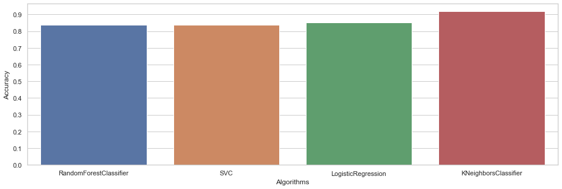

<h3 style='color:red'>Heart Disease - Classifications</h3>

The project involves some EDA && visualizations and predict whether the presence of heart disease in the patient using several machine learning algorithms.

**Table:**
1. **Introduction**
2. **Data Preparation**
3. **Visualization**
4. **Machine Learning**

**Dataset:** heart.csv

**Results:**

Take a look @kaggle:
[Heart Disease - Classifications](https://www.kaggle.com/code/elcaiseri/heart-disease-classifications)

DON'T FORGET TO **UPVOTE** IT IF YOU LIKE IT

Kassem@elcaiseri
